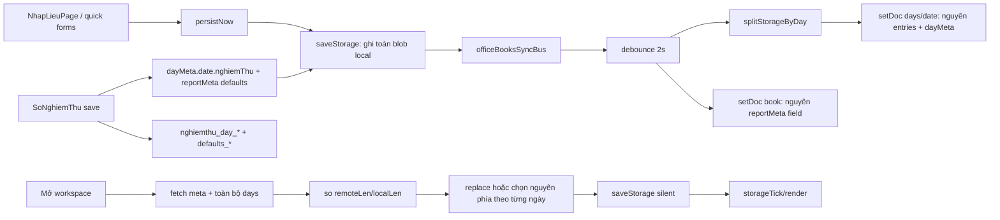
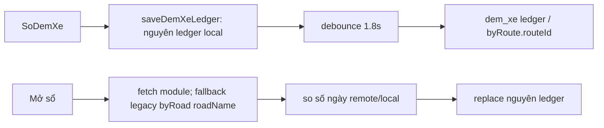
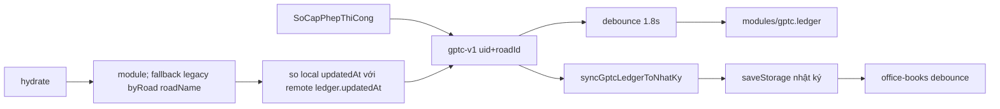
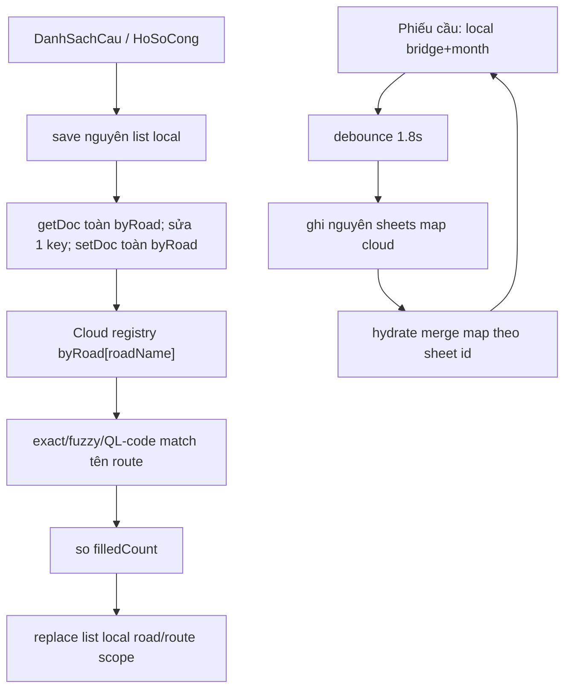

# RÀ SOÁT KIẾN TRÚC ĐỒNG BỘ ĐA THIẾT BỊ VÀ KẾ HOẠCH NÂNG CẤP AN TOÀN DỮ LIỆU

> Phạm vi rà soát: toàn bộ mã nguồn dạng text trong `src/`, `scripts/`, `public/` (205 file, 61.966 dòng tại thời điểm rà soát), tập trung lần theo điểm đọc/ghi thực tế. Không chạy ứng dụng, không ghi Firebase, không chạy migration, không đổi key/path và không sửa code nghiệp vụ.
>
> Kết luận ngắn: **chưa an toàn để cho hai máy cùng sửa một tài khoản/sổ**. `office_books/.../days/{date}` chia document theo ngày nhưng vẫn ghi đè nguyên `entries[]` và `dayMeta`; không có revision/transaction/conflict detection/realtime listener. Các module đếm xe, GPTC, phiếu cầu, registry cầu/cống cũng chủ yếu ghi đè blob/map. Cần hoàn thành các mục P0–P2 trong báo cáo trước khi công bố hỗ trợ đa máy.

## A. Kiến trúc hiện tại

### A1. Ma trận dữ liệu nghiệp vụ

| Dữ liệu | Local | Cloud | Read | Write | Sync | Scope |
|---|---|---|---|---|---|---|
| Nhật ký tuần đường (`entries`, `dayMeta`, `reportMeta`, `importMap`) | `nhatky_{uid}_{roadId}`; legacy `nhatky`, `nhatky_{uid}` | `users/{uid}/office_books/{roadId}` và `/days/{date}` | `loadStorage`; `fetchOfficeBookAsStorage` | `saveStorage`; `pushOfficeBookDays`, `pushOfficeBookMeta` | `useOfficeBooksSync`, debounce 2.000 ms | Cloud/local chung theo `roadId`; day doc theo ngày; entry có `routeId` optional |
| `reportMeta` | nằm trong blob `nhatky_{uid}_{roadId}` | field `reportMeta` tại book doc | `loadStorage`; `fetchOfficeBookMeta` | `saveReportMeta`/`saveStorage`; `pushOfficeBookMeta` | cùng hook office books | Chung `roadId`, nhưng 4 field tiêu đề bị đổi theo active route/view |
| `dayMeta` | map trong blob nhật ký | field `dayMeta` trong `days/{date}` | `loadStorage` | `saveStorage`; nguyên object ngày | cùng hook office books | `roadId + date`; không theo route |
| Nghiệm thu | `nghiemthu_day_{storageKey}__{date}`, `nghiemthu_defaults_{storageKey}`, legacy `nghiemthu_meta_{storageKey}`; đồng thời mirror vào `dayMeta[date].nghiemThu` và `reportMeta` | gián tiếp qua office book day/meta | `loadNghiemThuDayState`, ưu tiên day key → dayMeta → legacy | `saveNghiemThuDayState` | qua `saveStorage` → `useOfficeBooksSync` | Nội dung theo `roadId + date`; filter hiển thị theo route; nhân sự/default chung road |
| Đếm xe | `dem-xe-v1-{uid}__{roadId}`; multi-route thêm `__rt_{routeId}`; legacy `dem-xe-v1` | `office_books/{roadId}/modules/dem_xe`: `ledger` hoặc `byRoute[routeId]`; legacy `master_data/vehicle_count_ledger.byRoad[roadName]` | `DemXeRepository` → store/service | save nguyên ledger; cloud ghi nguyên ledger/route ledger | `useDemXeSync`, debounce 1.800 ms | 1 route: road; nhiều route: route; fallback road chỉ cho route đầu |
| GPTC | `gptc-v1-{uid}__{roadId}`; legacy `gptc-v1` | `office_books/{roadId}/modules/gptc.ledger`; legacy `master_data/construction_permit_ledger.byRoad[roadName]` | `loadGptcLedger`, `fetchGptcForRoad` | nguyên ledger | `useGptcSync`, debounce 1.800 ms; còn sync hai chiều một số field với nhật ký | **Chỉ road**, chưa có `byRoute` |
| Danh sách cầu | `cau-registry-v1-{uid}__{roadId}`; multi-route thêm `__rt_{routeId}`; legacy `cau-registry-v1` | `master_data/cau_registry.byRoad[roadName]` | store + `hydrateCauRegistriesFromCloud` | save nguyên list; `pushManyCau` read-modify-write toàn `byRoad` | hydrate khi mở; push khi trang danh sách cầu lưu | Local theo route khi nhiều nhánh; cloud key bằng tên route/đường |
| Hồ sơ cống | `cong-registry-v2-{uid}__{roadId}`; multi-route thêm `__rt_{routeId}`; legacy `cong-registry-v1` | `master_data/cong_registry.byRoad[roadName]` | store + `hydrateCongRegistriesFromCloud` | save nguyên list; `pushManyCong` read-modify-write toàn `byRoad` | hydrate trong `App`; push khi trang hồ sơ cống lưu | Local theo route khi nhiều nhánh; cloud key bằng tên route/đường |
| Phiếu kiểm tra cầu | `cau-inspection-v2-{uid}__{roadId}__{bridgeId}__{yyyy-mm}`; meta `cau-inspection-road-meta-v1-{uid}__{roadId}`; legacy v1 | `office_books/{roadId}/modules/cau_inspections` với map `sheets` | `loadCauInspectionSheet`; `fetchCauInspectionsModule` | local 1 sheet; cloud nguyên map `sheets` | `useCauInspectionSync`, debounce 1.800 ms | Road + bridge + month; **không có routeId** ngoài việc bridgeId đến từ registry đang chọn |
| Master data loại BDTX | `baoduong-quality-catalog-v1__{ownerUid}` + `__meta`; legacy key không owner | `master_data/data_noi_nghiep.catalog` | onSnapshot | thay toàn document | `useDataNoiNghiepSync` | catalog owner/admin, không road/route |
| Danh mục road/routes | `nhatky_roads_{uid}` | `master_data/office_roads_catalog` | onSnapshot | thay toàn document | `RoadWorkspaceContext` | user; road chứa `routes[]` |
| Incidents | không có persistence nghiệp vụ local; React state từ snapshot | `users/{uid}/incidents/{incidentId}` | `onSnapshot`/`getDocs` | document-per-record; phần lớn `updateDoc` field patch | realtime | record; dùng field `road` dạng tên, không `roadId/routeId` |
| Ảnh incident | URL nằm trong incident | Storage `images/{uid}/{incidentId}/{before|after}/...` | URL/Storage lookup | upload; xóa object khi xóa ảnh | trực tiếp | user + incident |
| Import map incident → nhật ký | trong mỗi blob nhật ký | `users/{uid}/nhat_ky_meta/main.importMap` | merge remote/local rồi reconcile | ghi đè toàn map | gọi trực tiếp khi import/save | map dùng chung user, record có `storageKey` |
| KL hợp đồng báo cáo | UI caches riêng; `reportMeta.contractVolumes` | `master_data/bao_cao_contract_volumes.byKey` và bản trong office-book meta | service + reportMeta | nguyên map/object | thao tác màn hình | admin/company hoặc road meta |

### A2. Persistence không nghiệp vụ nhưng phải biết để không xóa nhầm

- UI/layout: `nhatky-col-widths-v7`, `nhatky-preview-zoom`, `nhatky-control-sidebar-width`, `nhatky-print-margins-v1`, `matduong-*`, `hanh-lang-*`, `tngt-*`, `traffic-duty-*`, `baoduong-*`, `phieu-cau-*`, `gptc-print-margins-v1`, `demxe-print-margins-v1`, `danhmuc-bd-colwidths-v1`, các key `nhatky_stats_*`, `hientruong-dispatch-col-widths-v4`, `nhatky.incidentBulk.colW.v1`.
- Route UI: `nhatky_active_route_{uid}_{roadId}`, `nhatky_routes_view_{uid}_{roadId}`, `nhatky_title_routes_{uid}_{roadId}`.
- Chữ ký: `nhatky_sign_names_{roadStorageKey}`.
- Auth/portal: `nhatky_catalog_owner_{companyId}`, `qlsc_portal_email_{portalId}`; session keys `qlsc_portal_family`, `qlsc_active_portal`, `nhatky_bao_cao`.
- Không tìm thấy code dùng IndexedDB hay Cache Storage để persist dữ liệu nghiệp vụ. Firebase SDK có cache nội bộ mặc định nhưng project không gọi API bật Firestore offline persistence.

## B. Data flow thực tế

### B1. Nhật ký, reportMeta, dayMeta và nghiệm thu

- Nhật ký: `NhapLieuPage.persistNow` gọi `saveStorage` với **toàn bộ entries/dayMeta/reportMeta**. Entry mới thường không có stable `id`; sửa/xóa dùng index mảng.
- Hydrate: `useOfficeBooksSync.hydrate` chỉ chạy khi mount/scope đổi, không subscribe realtime. Nếu cloud có dữ liệu, `remoteLen >= localLen` có thể replace toàn local. Khi không replace, mỗi ngày chọn nguyên mảng local hoặc remote dựa trên số dòng.
- `reportMeta`: push nguyên object dưới field `reportMeta`. `{merge:true}` chỉ merge top-level book doc; nó **không merge từng field con** của `reportMeta`.
- `dayMeta`: nằm cùng doc ngày với `entries[]`; push nguyên object.
- Nghiệm thu: day-key local là nguồn đọc ưu tiên. Bản mirror trong `dayMeta` mới được cloud sync; do đó day-key cũ trên một máy có thể che bản cloud mới đã hydrate vào `dayMeta`.

### B2. Đếm xe

Cloud `byRoute.{routeId}` được update theo field path nên hai route khác nhau ít va chạm hơn; nhưng hai máy sửa cùng route vẫn last-write-wins nguyên ledger. Tạo module mới dùng `setDoc` không merge, có cửa sổ race khi hai route đầu tiên cùng được tạo.

### B3. GPTC

`serverTimestamp` đặt ở wrapper document nhưng `fetchGptcForRoad` trả về `ledger`, nên timestamp server không tham gia so sánh. So sánh thực tế dùng `ledger.updatedAt` là `Date.now()` của client: lệch giờ máy có thể quyết định sai. GPTC hiện chung road; không lưu routeId.

### B4. Cầu, cống và phiếu cầu

- Cầu/cống cloud dùng **tên hiển thị** làm identifier. Đổi tên route có thể tạo key mới và để key cũ mồ côi; fuzzy match có thể ghép nhầm.
- Phiếu cầu merge theo sheet ID khi hydrate nhưng mỗi push gửi nguyên map; hai máy có thể làm mất sheet của nhau hoặc resurrect sheet đã xóa.

### B5. Master data và incidents

- `data_noi_nghiep`: onSnapshot cloud → replace local. Admin save thay toàn document, không revision; hai admin cùng sửa vẫn last-write-wins.
- Incidents: `users/{uid}/incidents/{id}` + onSnapshot. Create có Firestore document ID ổn định; update dùng `updateDoc`. Đây là mô hình đa máy tốt nhất hiện tại. Soft delete/tombstone có sẵn (`deleted=1`), nhưng permanent delete và xóa ảnh là destructive.
- Import incident → nhật ký: tạo/cập nhật entry trong blob nhật ký và ghi toàn `importMap`. Entry import có `sourceIncidentId` nhưng chưa có stable diary record ID và chưa gắn routeId tự động.

## C. Các nguy cơ

### C1. CRITICAL

#### C-01 — Lost update trong cùng ngày

- **File/function:** `src/services/officeBooksService.js:102-138` (`pushOfficeBookDay(s)`), `src/hooks/useOfficeBooksSync.js:52-76`, `src/utils/officeBooksLocal.js:89-109`.
- **Nguyên nhân:** mỗi save ghi nguyên `entries[]` và `dayMeta`; không transaction/revision/precondition; merge Firestore không merge phần tử mảng.
- **Tình huống:** A và B cùng hydrate v1. A thêm/sửa entry rồi push v2. B giữ v1, sửa entry khác rồi push v3.
- **Hậu quả:** v3 thay toàn mảng và làm mất thay đổi của A. Hai máy sửa hai entry khác nhau vẫn xung đột.

#### C-02 — Xóa có thể sống lại

- **File/function:** như C-01; thêm `useOfficeBooksSync.hydrate` và `mergeRemoteIntoLocalStorage`.
- **Nguyên nhân:** diary entry không có tombstone/stable ID; “xóa” chỉ loại phần tử khỏi snapshot. B còn snapshot cũ sẽ push phần tử trở lại. Logic “bên nhiều dòng hơn mới hơn” còn ưu tiên chính bản chưa xóa.
- **Tình huống:** A xóa entry, B chưa refresh rồi save.
- **Hậu quả:** record sống lại, không có audit để biết ai/xóa lúc nào.

#### C-03 — Offline queue không bền; đóng tab có thể mất lần push

- **File/function:** `useOfficeBooksSync.schedulePush`, `useDemXeSync.schedulePush`, `useGptcSync.schedulePush`, `useCauInspectionSync.schedulePush`.
- **Nguyên nhân:** timer trong memory; catch chỉ `console.warn`; không pending queue, retry bền, unload flush, sync status.
- **Tình huống:** mất mạng hoặc đóng tab trong 1,8–2 giây sau save.
- **Hậu quả:** local có thay đổi nhưng cloud không có; mở máy khác thấy dữ liệu cũ. Khi hydrate lại, logic số lượng có thể đè local.

### C2. HIGH

#### H-01 — Hydrate chọn “mới hơn” bằng `.length`

- **File/function:** `useOfficeBooksSync.js:98-110`; `officeBooksLocal.js:89-128`; `useDemXeSync.js:91-121`; `cauRegistryService.js:55-107`; `congRegistryService.js:164-226`; `useCauInspectionSync.js:107-142`.
- **Nguyên nhân:** số record/ngày/sheet không biểu thị freshness.
- **Tình huống:** bản mới hợp lệ có ít record hơn vì xóa/gộp; bản cũ nhiều record hơn.
- **Hậu quả:** bản cũ thắng hoặc được push ngược lên cloud.

#### H-02 — `reportMeta` khác field vẫn overwrite toàn object

- **File/function:** `pushOfficeBookMeta`; `useOfficeBooksSync.flushPush`; `syncRoadMetaToStorage`.
- **Nguyên nhân:** set field `reportMeta` bằng nguyên object. `{merge:true}` không phải deep field merge.
- **Tình huống:** A sửa nhân sự nghiệm thu; B sửa `trafficDutyPerson` hoặc contract volumes.
- **Hậu quả:** object của người push sau xóa field mới của người kia.

#### H-03 — Route/view đổi các field chung của `reportMeta`

- **File/function:** `RoadWorkspaceContext.jsx:187-203,227-319`; `roadsCatalog.syncRoadMetaToStorage`.
- **Nguyên nhân:** chọn active route hoặc split/merged ghi lại `reportMeta.roadName/kmRange` trong cùng kho road.
- **Tình huống:** A đang route 1, B route 2; mỗi bên save sau khi catalog meta được áp.
- **Hậu quả:** tiêu đề cloud dao động theo máy/route cuối cùng, dù entries chung road.

#### H-04 — Registry cầu/cống dùng `roadName` và read-modify-write toàn map

- **File/function:** `cauRegistryService.pushManyCau`, `congRegistryService.pushManyCong`, `pickCongListForRoad/Route`.
- **Nguyên nhân:** key mutable; getDoc → sửa local → setDoc toàn `byRoad` không transaction.
- **Tình huống:** A cập nhật route X, B cập nhật route Y từ snapshot cũ; hoặc admin đổi tên route.
- **Hậu quả:** mất update route kia, dữ liệu mồ côi/ghép nhầm/duplicate.

#### H-05 — Phiếu cầu ghi nguyên map `sheets`

- **File/function:** `cauInspectionService.pushCauInspections`; `useCauInspectionSync.flushPush/hydrate`.
- **Nguyên nhân:** mỗi máy collect toàn local sheets rồi overwrite map cloud; không tombstone.
- **Tình huống:** A sửa sheet cầu 1, B sửa sheet cầu 2; hoặc A xóa sheet B còn giữ.
- **Hậu quả:** lost update hoặc resurrection ở cấp sheet.

#### H-06 — GPTC và đếm xe ghi nguyên ledger

- **File/function:** `gptcService.pushGptcForRoad`, `demXeService.pushDemXeForRoad`, các sync hook.
- **Nguyên nhân:** blob last-write-wins; GPTC client timestamp; đếm xe so số ngày.
- **Tình huống:** hai máy sửa hai permit/ngày khác nhau trong cùng ledger.
- **Hậu quả:** một thay đổi bị mất.

### C3. MEDIUM

#### M-01 — Route mới vs client/schema cũ

- **File/function:** `roadsCatalog.normalizeRoute/getRoadRoutes`, `NhapLieuPage` route stamping, registry/demXe scope helpers.
- **Nguyên nhân:** routeId optional và client cũ có thể lưu lại toàn entry/ledger không biết field/scope mới.
- **Tình huống:** A thêm routeId; B dùng code cũ hydrate rồi save blob.
- **Hậu quả:** field routeId của entry có thể mất nếu client cũ reconstruct record; registry route-scoped có thể không được client cũ thấy. `migrateEntry` hiện spread `...entry` nên client hiện tại giữ field, nhưng không bảo vệ trước phiên bản cũ thật sự.

#### M-02 — Legacy entry không routeId hiển thị ở mọi route nếu không có km

- **File/function:** `roadsCatalog.entryMatchesRouteView:454-475`.
- **Nguyên nhân:** fallback legacy trả `true` khi không routeId/km.
- **Hậu quả:** cùng record xuất hiện ở nhiều view; không thể tự động gán route chắc chắn.

#### M-03 — Cầu/cống trùng cung Km hoặc tên gần giống có thể ghép sai

- **File/function:** `findCauByKmOrId`, `syncCauInspectionsFromEntries`, `pickCongListForRoad` fuzzy match.
- **Nguyên nhân:** fallback theo km/name khi ID thiếu; key cloud theo tên.
- **Hậu quả:** damage đi vào sai cầu; registry đi vào sai nhánh.

#### M-04 — Nghiệm thu có hai local source song song

- **File/function:** `loadNghiemThuDayState`, `saveNghiemThuDayState`.
- **Nguyên nhân:** day key local được ưu tiên hơn bản cloud mirror trong `dayMeta`.
- **Hậu quả:** máy cũ tiếp tục hiển thị/sửa bản local cũ sau hydrate cloud.

#### M-05 — `importMap` chung user, ghi nguyên object

- **File/function:** `nhatKyMetaService`, `nhatKyImportService`.
- **Nguyên nhân:** read/merge/write không transaction; reconcile phụ thuộc snapshot entries hiện tại.
- **Hậu quả:** hai máy import/xóa link đồng thời có thể mất mapping hoặc khóa tick sai.

### C4. LOW

- Stable IDs hiện có ở incident, permit/permit-entry, cầu/cống, direction đếm xe, nhưng sinh bằng `Date.now()+counter` (không collision-proof đa máy). Diary entry thường không có ID.
- `syncRoadMetaToStorage` ghi local trực tiếp không phát sync event; meta chỉ chắc chắn lên cloud ở lần flush/save tiếp theo hoặc qua service catalog.
- `removeRoad` xóa ngay local book key; admin remove cloud catalog không xóa cloud office book. Hành vi lệch nhau cần đóng băng và làm rõ trước khi chỉnh.

## C5. Trả lời sáu case đa thiết bị

| Case | Kết luận hiện tại |
|---|---|
| A — A push, B giữ local cũ rồi save | **Có, B có thể ghi đè A** ở day blob, reportMeta, các ledger/map. |
| B — A offline, B online | A chỉ giữ local. Khi online không có listener/queue tự động đáng tin cậy; nếu tab còn mở timer có thể retry chỉ khi có save mới. Khi reload, hydrate có thể chọn cloud hoặc local bằng count, rồi push snapshot thắng — kết quả không xác định theo freshness. |
| C — A xóa, B còn record | **Có, B có thể làm record sống lại** vì không tombstone và snapshot B vẫn chứa record. |
| D — A có routeId mới, B schema cũ | Client hiện tại spread field nên thường giữ; client cũ/reconstruct toàn object có thể làm mất. Không có `schemaVersion`/minimum client gate ở entry để ngăn. |
| E — hai máy sửa hai entry khác nhau cùng ngày | **Lost update chắc chắn có thể xảy ra** vì cả `entries[]` được ghi lại. |
| F — hai máy sửa hai field reportMeta | **Overwrite toàn `reportMeta`**, không field merge. |

## D. Road / Route analysis

### D1. Cái gì chung road, cái gì theo route

| Thành phần | Scope thực tế | Nhận xét |
|---|---|---|
| Kho nhật ký, dayMeta, reportMeta, nghiệm thu | Road | entry route-aware optional; dayMeta/nghiệm thu không route-native |
| Entries mới từ form/quick-entry | Có `routeId` + `roadName` khi active route tồn tại | routeId không bắt buộc; import incident/GPTC có thể không gắn |
| Đếm xe | Route nếu road có >1 route; road/legacy nếu 1 route | có dual-read fallback route đầu |
| Cầu/cống local | Route nếu >1 route | cloud vẫn byRoad tên hiển thị |
| Phiếu cầu | Road + bridge + month | bridge ID gián tiếp phân route; module cloud chung road |
| GPTC | Road | chưa có routeId/byRoute; nếu nghiệp vụ permit thuộc một nhánh thì thiếu scope |
| Biên bản nghiệm thu | Save theo road+date; dữ liệu tự sinh được filter theo view route | bản lưu override không ghi route scope; cần quyết định nghiệp vụ trước khi tách |
| split/merged/titleRouteIds | UI + sửa 4 field tiêu đề reportMeta | entries không bị move/split, nhưng meta persistence bị ảnh hưởng nên **không hoàn toàn chỉ UI** |

### D2. Nơi dùng identifier nguy hiểm

- `master_data/cau_registry.byRoad[roadName]` và `cong_registry.byRoad[roadName]`.
- Legacy đếm xe `vehicle_count_ledger.byRoad[roadName]` và GPTC `construction_permit_ledger.byRoad[roadName]`.
- `pickCongListForRoad` fuzzy/extract QL; đổi tên hoặc hai nhánh cùng mã QL có thể match sai.
- Incidents lưu `road` là chuỗi hiển thị; import vào sổ dựa trên sổ user đang chọn, không có liên kết `roadId/routeId` bền.
- `reportMeta.roadName` là display meta, không nên dùng làm ID; hiện legacy services vẫn dùng.

### D3. Route ID hiện được lưu ở đâu

- Catalog: `master_data/office_roads_catalog.roads[].routes[].id` và local `nhatky_roads_{uid}`.
- UI selection: ba local keys active/view/title.
- Diary entries: optional `entry.routeId`; form thường stamp active route. `roadName` cũng được copy vào entry.
- DemXe: local scope suffix `__rt_{routeId}`, cloud `byRoute[routeId]`.
- Cầu/cống: local scope suffix; cloud không có routeId native.
- GPTC, nghiệm thu saved state, phiếu cầu module: không có routeId native.

## E. Legacy compatibility — key/path bắt buộc giữ

### E1. LocalStorage

- `nhatky`, `nhatky_{uid}`, `nhatky_{uid}_{roadId}`, `nhatky_roads_{uid}`.
- `nhatky_active_route_{uid}_{roadId}`, `nhatky_routes_view_{uid}_{roadId}`, `nhatky_title_routes_{uid}_{roadId}`.
- `dem-xe-v1`, `dem-xe-v1-{uid}__{roadId}`, `dem-xe-v1-{uid}__{roadId}__rt_{routeId}`.
- `gptc-v1`, `gptc-v1-{uid}__{roadId}`.
- `cau-registry-v1`, `cau-registry-v1-{uid}__{roadId}[__rt_{routeId}]`.
- `cong-registry-v1`, `cong-registry-v2-{uid}__{roadId}[__rt_{routeId}]`.
- `cau-inspection-v1-*`, `cau-inspection-v2-*`, `cau-inspection-road-meta-v1-*`.
- `nghiemthu_meta_*`, `nghiemthu_day_*`, `nghiemthu_defaults_*`.
- `baoduong-quality-catalog-v1`, owner-scoped key và `__meta`.
- Toàn bộ key UI/auth ở A2; không rename/xóa trong migration dữ liệu.

### E2. Firestore/Storage

- `users/{uid}/office_books/{roadId}` và `/days/{date}`.
- `office_books/{roadId}/modules/{dem_xe,gptc,cau_inspections}`.
- `master_data/{office_roads_catalog,cau_registry,cong_registry,vehicle_count_ledger,construction_permit_ledger,data_noi_nghiep,roads,groups,types,bao_cao_contract_volumes}`.
- `users/{uid}/nhat_ky_meta/main`.
- `users/{uid}/incidents/{incidentId}`.
- Storage `images/{uid}/{incidentId}/{before|after}/...`.

Đọc mới phải dual-read; migrate phải copy/augment, tuyệt đối không move/delete nguồn legacy.

## F. Migration plan: Expand → Migrate → Contract

### Phase 1 — EXPAND (release tương thích, chưa migrate dữ liệu)

Mục tiêu: thêm metadata an toàn nhưng hành vi user gần như không đổi.

1. Thêm helper optional cho `recordId`, `schemaVersion`, `revision`, `updatedAt`, `deletedAt`; reader chấp nhận thiếu tất cả field.
2. Mọi entry mới có UUID ổn định; entry legacy chỉ được bổ sung ID khi user thực sự sửa hoặc trong shadow-index local, không batch rewrite.
3. Thêm client-generated `operationId` và outbox local bền (key mới), trạng thái `pending/synced/conflict/error`; không xóa blob cũ.
4. Với day blob hiện tại, thêm optimistic concurrency: đọc `revision`, transaction so revision rồi commit. Nếu mismatch: fetch latest, merge theo stable record ID; nếu record legacy chưa ID thì dừng conflict thay vì đoán.
5. Tombstone optional cho delete mới; reader vẫn hiểu record biến mất kiểu cũ.
6. `reportMeta`: update bằng dotted field patch hoặc transaction theo field; route display meta tách thành derived UI, nhưng vẫn giữ/đọc field cũ.
7. Registry: thêm `byRoute[routeId]` song song `byRoad`; Phase 1 ưu tiên dual-read, chỉ dual-write khi mapping route chắc chắn.
8. GPTC/phiếu cầu/đếm xe: thêm revision/updatedAt server; chưa đổi path. GPTC thêm optional `routeId`/`byRoute` reader nếu nghiệp vụ xác nhận.
9. Telemetry/audit conflict tối thiểu và kill switch để quay về write legacy.

**File dự kiến sửa:** `nhatKyFormat.js`, `officeBooksLocal.js`, `officeBooksService.js`, `useOfficeBooksSync.js`, `roadsCatalog.js`, `RoadWorkspaceContext.jsx`, `demXe*`, `gptc*`, `cauRegistry*`, `congRegistry*`, `cauInspection*`, `nghiemThuFormat.js`, các form tạo entry và test mới. Không đổi path/key cũ.

### Phase 2 — MIGRATE DẦN

1. New/edit-touch diary records có stable ID, revision, routeId khi xác định chắc chắn.
2. Shadow-write record-level representation (ví dụ subcollection mới) **sau** khi legacy day write thành công; hoặc transaction/outbox đảm bảo retry idempotent. Legacy `entries[]` tiếp tục được duy trì cho client cũ trong cửa sổ tương thích.
3. Backfill on-touch: legacy entry khi user mở sửa được gắn ID/routeId; không tự suy route nếu km overlap/trùng hoặc thiếu dữ liệu.
4. Cầu/cống/demXe/GPTC copy sang `byRoute` bằng deterministic ID/hash + migration marker; không xóa `byRoad/ledger`.
5. Mỗi job ghi `migrationVersion`, source checksum, target checksum, counts, started/completedAt; chạy lại không duplicate.
6. Đọc ưu tiên schema mới chỉ sau khi đối chiếu; fallback legacy ngay nếu mismatch/flag off.

**File dự kiến sửa/thêm:** services hiện hữu; script export/verify/migrate riêng chạy dry-run mặc định; migration manifest; admin-only diagnostics. Không nhúng destructive migration vào app startup.

### Phase 3 — CONTRACT (chưa triển khai)

Chỉ sau nhiều release, telemetry xác nhận 100%, backup restore drill đạt và không còn client cũ:

- Ngừng dual-write; giữ reader legacy thêm một chu kỳ dài.
- Archive nguồn legacy ở chế độ read-only trước khi cân nhắc xóa.
- Chỉ xóa/contract bằng thay đổi riêng, có approval và snapshot ngay trước thao tác.

## G. Thứ tự thực hiện an toàn

- [ ] **P0 Backup:** export Firestore + Storage manifest + local export từng user/browser; checksum/count và thử restore vào project/staging tách biệt.
- [ ] **P0 Observability:** dashboard sync error/conflict/outbox; hiển thị “chưa đồng bộ” cho user.
- [ ] **P1 Stable ID + tombstone cho diary entry mới**, hoàn toàn optional với legacy.
- [ ] **P1 Revision + Firestore transaction cho day blob**, xử lý conflict không silent overwrite.
- [ ] **P1 Outbox bền + retry + unload-safe**, không dựa timer memory.
- [ ] **P1 Field-level reportMeta update**, chặn active route ghi đè business meta.
- [ ] **P1 Revision/merge record-level cho GPTC, đếm xe, phiếu cầu, registry** trước khi tuyên bố hỗ trợ đa máy các module đó.
- [ ] **P2 Route compatibility:** routeId optional, UI bắt chọn khi ambiguous; incident import cho phép chọn route.
- [ ] **P2 Registry dual-read/dual-write `byRoad` + `byRoute`**, đổi tên route không đổi ID.
- [ ] **P2 Shadow record schema cho entries**, migrate on-touch và verifier.
- [ ] **P3 Contract** chỉ sau audit dài hạn.

### Bắt buộc trước release đa máy

- Stable ID cho record được sửa/xóa; server revision + transaction/precondition.
- Tombstone cho delete và rule merge không resurrect.
- Pending outbox bền, retry idempotent, sync status nhìn thấy được.
- Conflict detection/UX tối thiểu; tuyệt đối không chọn winner bằng `.length`.
- `reportMeta` field-level merge.
- Backup + restore drill + audit log tối thiểu (`uid/device/operationId/revision`).

### Có thể làm sau

- Full event sourcing, CRDT, field-level merge mọi field, UI lịch sử đẹp, subcollection hoàn chỉnh cho mọi module, tự động contract legacy. Không cần để release đầu nếu transaction + record merge đã đủ.

## H. Test plan

### H1. Ma trận bắt buộc

1. A/B online, cùng road; xác minh subscription/revision.
2. A offline, B online; A reconnect; outbox replay idempotent.
3. A/B cùng sửa một entry: conflict hiển thị, không silent overwrite.
4. A/B sửa hai entry khác nhau cùng ngày: cả hai còn.
5. A xóa, B còn snapshot cũ rồi save: tombstone thắng, record không sống lại.
6. A xóa rồi undo/restore có chủ đích: revision mới hợp lệ.
7. Hai máy sửa hai field `reportMeta`: cả hai field còn.
8. Legacy record không routeId: đọc/print không đổi; sửa thì chỉ gắn route khi user xác nhận.
9. Hai route trùng cung Km: không auto-assign; bắt chọn.
10. Đổi tên route: dữ liệu byRoute vẫn nguyên; dual-read key tên cũ còn hoạt động.
11. Đổi máy/browser sạch: hydrate đủ, không cần local legacy.
12. Mất mạng giữa save và cloud ack: pending tồn tại qua reload.
13. Đóng tab ngay sau save: pending còn và replay khi mở lại.
14. Cầu/cống legacy bằng tên đường: dual-read, không xóa source.
15. Đếm xe legacy `dem-xe-v1` và `vehicle_count_ledger.byRoad`: route đầu đọc đúng, không nhân sang route khác.
16. GPTC legacy: đọc đúng, delete link nhật ký không resurrect.
17. Phiếu cầu: A/B sửa hai sheet và cùng sheet; merge/conflict đúng.
18. Nghiệm thu: local day key cũ không che cloud revision mới vô thời hạn.
19. Client cũ và client Phase 1 cùng hoạt động; new fields không bị mất.
20. Clock skew ±24h: kết quả không phụ thuộc `Date.now()` client.

### H2. Kiểm thử backup/migration

- Dry-run chỉ đọc; manifest counts theo collection/path/road/date/schemaVersion.
- Export trước migration; SHA-256 cho file export và canonical JSON record sets.
- Chạy migrate hai lần: lần hai zero net-new/zero duplicate.
- So sánh trước/sau: tổng record active + tombstone, IDs, ảnh, day counts, module counts.
- Inject failure sau mỗi bước; resume đúng checkpoint.
- Rollback bằng feature flag/read preference trước; restore snapshot khi dữ liệu source bị ảnh hưởng.
- Restore drill vào Firebase project tách biệt, kiểm tra UI bằng tài khoản test.

## I. Những thứ TUYỆT ĐỐI KHÔNG ĐƯỢC sửa ngay

- Không rename/move/delete bất kỳ key/path ở E.
- Không xóa legacy `entries[]`, `dayMeta`, `reportMeta`, `byRoad`, `ledger`, sheet map hay incident fields.
- Không tự động gán routeId từ roadName/Km khi có nhiều kết quả hoặc thiếu dữ liệu.
- Không đổi roadId/routeId đã phát hành; đổi tên chỉ là display field.
- Không chạy migration ở app startup/login.
- Không batch rewrite production để thêm ID/schemaVersion.
- Không hard-delete incident/ảnh/legacy registry trong migration.
- Không bật dual-write nếu chưa có operation ID, idempotency và verifier.
- Không coi serverTimestamp một mình là conflict control.
- Không deploy client mới khiến client cũ ghi mất unknown fields; cần compatibility test/gate.

## Backup / rollback chi tiết

1. Dùng Firestore managed export hoặc Admin SDK export read-only cho toàn `users`; lưu metadata project/database/time.
2. Liệt kê toàn Storage prefix `images/`, lưu object generation, size, md5/crc32c, contentType; snapshot/bucket versioning theo chính sách hạ tầng.
3. Thêm chức năng export local JSON **chỉ đọc** cho các key E1 trước khi migrate on-device.
4. Manifest theo user/road/date/module: số doc, số entries active/tombstone, số routeId missing, min/max revision, checksum.
5. Restore ưu tiên project staging mới. Production restore cần maintenance window, approval, snapshot lần hai và script idempotent.
6. Rollback Phase 1 chủ yếu bằng feature flag: ngừng new write/read preference, quay lại legacy reader; vì Phase 1 không xóa nguồn cũ.

## RECOMMENDED IMPLEMENTATION ORDER

Mỗi commit dưới đây nhỏ, có feature flag hoặc rollback độc lập, và không xóa dữ liệu legacy:

1. **Commit 1 — backup manifest + read-only export/dry-run verifier.** Không thay runtime write.
2. **Commit 2 — compatibility types/helpers.** Optional `recordId/schemaVersion/revision/updatedAt/deletedAt`, reader giữ unknown fields.
3. **Commit 3 — stable IDs cho record mới.** Không backfill hàng loạt; test collision/idempotency.
4. **Commit 4 — durable sync outbox + status UI.** Legacy write vẫn là primary; shadow enqueue/retry.
5. **Commit 5 — revision transaction cho office-book day blob.** Precondition, conflict result; chưa chuyển path.
6. **Commit 6 — record merge + tombstone cho diary.** Hai entry khác nhau merge; cùng entry conflict; delete không resurrect.
7. **Commit 7 — reportMeta field patches và tách route display derivation.** Giữ field legacy đọc/ghi tương thích.
8. **Commit 8 — sync safety cho đếm xe/GPTC/phiếu cầu.** Revision theo ledger/sheet; bỏ count-as-freshness.
9. **Commit 9 — registry `byRoute` dual-read.** Không write/migrate tự động.
10. **Commit 10 — registry dual-write có operation ID + verifier.** Chỉ route mapping chắc chắn; giữ `byRoad`.
11. **Commit 11 — route normalization on-touch.** UI xử lý ambiguous; incident/GPTC route choice nếu nghiệp vụ yêu cầu.
12. **Commit 12 — shadow record-level entries + gradual copy.** Feature flag, checksum, no delete.
13. **Commit 13 — migration dashboard/audit/restore drill.** Chỉ sau khi các commit trước ổn định.

**Điểm dừng:** chưa triển khai bất kỳ commit nào ở trên cho tới khi báo cáo này được review và phạm vi Phase 1 được phê duyệt.
