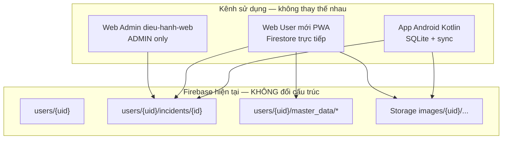

# Kế hoạch bổ sung Web User (PWA) — Không thay đổi hệ thống hiện tại

> **Trạng thái:** Đã triển khai `web-user/` — build thành công  
> **Ngày:** 2026-06-03  
> **Firebase project:** `quanlysuco-6797e`  
> **Ưu tiên:** Không ảnh hưởng App Kotlin · Web Admin điều hành · dữ liệu khách hàng đang dùng

---

## 1. Tóm tắt điều hành

Bổ sung **một ứng dụng web mới** (`web-user/`) dành cho hạt trưởng / nhân viên hiện trường dùng iPhone, iPad, Android browser, laptop. Ứng dụng:

- Đăng nhập bằng **cùng tài khoản Firebase Auth** như App Kotlin
- Đọc/ghi **trực tiếp** vào Firestore + Storage **hiện có**
- **Không** thay App Kotlin, **không** sửa Web Admin (`dieu-hanh-web`), **không** migrate dữ liệu
- Triển khai dưới dạng **PWA** (Add to Home Screen)



---

## 2. Phân tích hiện trạng (đã đọc source)

### 2.1 App Android Kotlin — **GIỮ NGUYÊN, KHÔNG SỬA**

| Thành phần | Chi tiết |
|------------|----------|
| Local DB | `tuanduong.db` v11, bảng `incidents` |
| Sync | `FirebaseSync.kt` — upload merge, `downloadAll` / `pullFromServerIfStale` |
| Firestore path | `users/{uid}/incidents/{incidentId}` |
| Storage path | `images/{uid}/{safeIncidentId}/{before\|after}/{timestamp}_{fileName}` |
| Ảnh trên doc | `beforeImages[]`, `afterImages[]` (arrayUnion URL) |
| Nghiệp vụ | `IncidentDispatch.kt` — progress 0–100, khóa core 24h, `updates[]` |
| Khối lượng | `dai × rong × cao` (hoặc 2/1 chiều); đơn vị `m3`, `m2`, `m`, cột, biển… |
| Master data | `users/{catalogOwnerUid}/master_data/{roads,groups,types}` |
| License | `users/{uid}.active`, `expireDate`; `DeviceSessionManager` giới hạn thiết bị |
| Export | `ExcelExporter.kt`, `WordExporter.kt`, ZIP ảnh (`ReportActivity`) |

**File tham chiếu chính:**
- `app/src/main/java/incident/model/Incident.kt`
- `app/src/main/java/com/tuanduong/FirebaseSync.kt`
- `app/src/main/java/com/tuanduong/sync/IncidentDispatch.kt`
- `app/src/main/java/com/tuanduong/app/AddIncidentActivity.kt`
- `app/src/main/java/com/tuanduong/app/LoginActivity.kt`
- `docs/MIGRATION_INCIDENT_DISPATCH.md`

### 2.2 Web Admin điều hành (`dieu-hanh-web`) — **GIỮ NGUYÊN, KHÔNG SỬA**

| Thành phần | Chi tiết |
|------------|----------|
| Đối tượng | `role === 'ADMIN'` (lãnh đạo công ty) |
| Auth guard | `useAuth.ts` — **từ chối USER**, sign out ngay |
| Query | `collectionGroup('incidents')` + `companyId` |
| Chức năng | Xem/sửa/xóa (soft) sự cố toàn công ty, catalog, Excel |
| Deploy | `website/dashboard/`, `website/dieu-hanh/` qua `build-dieu-hanh.bat` |

**Không được:** nới `useAuth` cho USER, đổi route, đổi `incidentsService` dùng chung — tránh regression khách ADMIN đang dùng.

### 2.3 Firebase — **GIỮ NGUYÊN cấu trúc**

#### Firestore collections/documents (không tạo mới)

| Path | Vai trò |
|------|---------|
| `users/{uid}` | Profile, license, `role`, `companyId`, `catalogOwnerUid`, `activeDevices` |
| `users/{uid}/incidents/{docId}` | Sự cố (mỗi USER một subcollection) |
| `users/{uid}/master_data/roads` | `{ list: string[] }` |
| `users/{uid}/master_data/groups` | `{ list: string[] }` |
| `users/{uid}/master_data/types` | `{ map: Record<group, string[]> }` |
| `leads/{id}`, `devices/{id}` | License-admin — Web User **không đụng** |

#### Incident document — field contract (Web User phải khớp 100%)

**Legacy (bắt buộc):**  
`incidentId`, `uuid`, `code`, `road`, `groupName`, `type`, `date`, `km`, `position`, `dai`, `rong`, `cao`, `unit`, `note`, `deleted`, `beforeImages[]`, `afterImages[]`

**Dispatch (bắt buộc khi tạo/sửa từ Web User):**  
`status`, `progress`, `locked`, `createdAt`, `updatedAt`, `createdByName`, `companyId`, `priority`, `completedDate`, `updates[]`

#### Storage — **không đổi đường dẫn**

```
images/{auth.uid}/{incidentId}/{before|after}/{timestamp}_{safeFileName}
```

Rules hiện tại (`storage.rules`): owner `auth.uid == userId` → read/write. **Web User đã đủ quyền, không cần sửa rules.**

#### Firestore rules — **không bắt buộc sửa cho Web User**

USER đã có quyền:
- **Đọc/ghi** `users/{ownUid}/incidents` khi `active == true` (`canWriteIncident`)
- **Đọc** `master_data` của ADMIN cùng `companyId` (`sameCompanyPeer`)
- **Không** dùng `collectionGroup` (chỉ ADMIN/seller)

Khóa 24h: khi `locked == true`, rules chặn đổi core fields (`road`, `km`, `groupName`, `type`, `dai`, `rong`, `cao`, `unit`, `date`) — Web User **phải tuân thủ ở UI**, giống app.

---

## 3. Những gì sẽ THÊM (phạm vi duy nhất được phép)

### 3.1 Project mới: `web-user/`

| Mục | Quyết định |
|-----|------------|
| Vị trí | Thư mục mới `C:\Users\PC\AndroidStudioProjects\QuanLySuCo\web-user\` |
| Stack | React 19 + TypeScript + Vite + Tailwind (đồng bộ `dieu-hanh-web`) |
| Router | HashRouter (`base: './'`) — host subfolder như dashboard |
| Firebase | Cùng project, config qua `public/firebase-config.js` hoặc `VITE_*` |
| Deploy | `website/user/` (hoặc `/app/`) + script build riêng `website/build-web-user.bat` |
| PWA | `vite-plugin-pwa` — manifest, icons, service worker cache shell |

**Lý do tách project:** Zero risk cho `dieu-hanh-web` và `license-admin` đang production.

### 3.2 Module / file mới (trong `web-user/`)

```
web-user/
├── public/
│   ├── firebase-config.js
│   ├── manifest.webmanifest (qua vite-plugin-pwa)
│   └── icons/ (192, 512, apple-touch-icon)
├── src/
│   ├── firebase/firebase.ts
│   ├── services/
│   │   ├── authService.ts          # USER profile + license check
│   │   ├── incidentsService.ts     # CRUD own incidents (mở rộng từ dieu-hanh)
│   │   ├── imageUploadService.ts   # Storage path khớp Android
│   │   ├── masterDataService.ts    # đọc catalog (copy/adapt)
│   │   ├── dispatchService.ts      # progress, updates[], locked logic
│   │   ├── incidentExportService.ts
│   │   └── passwordService.ts
│   ├── lib/                        # copy từ dieu-hanh-web (pure functions)
│   │   ├── incidentDispatch.ts     # port IncidentDispatch.kt → TS
│   │   ├── incidentUtils.ts
│   │   ├── incidentFilters.ts
│   │   ├── incidentStats.ts
│   │   ├── excelReportBuilder.ts
│   │   ├── kmUtils.ts
│   │   └── positionUtils.ts
│   ├── pages/
│   │   ├── LoginPage.tsx
│   │   ├── HomePage.tsx
│   │   ├── AddIncidentPage.tsx
│   │   ├── IncidentListPage.tsx
│   │   ├── IncidentDetailPage.tsx
│   │   ├── StatsPage.tsx
│   │   └── ProfilePage.tsx
│   ├── components/
│   │   ├── layout/UserAppLayout.tsx
│   │   ├── incident/IncidentForm.tsx
│   │   ├── incident/ProgressPanel.tsx
│   │   ├── incident/IncidentImageGallery.tsx
│   │   ├── incident/CameraCaptureInput.tsx
│   │   └── auth/ForgotPasswordDialog.tsx, ChangePasswordDialog.tsx
│   └── hooks/useAuth.ts            # Cho phép USER, từ chối ADMIN
```

### 3.3 Chức năng theo menu (map nghiệp vụ)

| Menu | Nguồn dữ liệu | Ghi chú |
|------|---------------|---------|
| **Trang chủ** | `fetchIncidentsByOwner(uid)` + stats local | Nút lớn: Thêm SC, Danh sách, Thống kê; thống kê nhanh giống `MainActivity` |
| **Thêm sự cố** | Ghi `users/{uid}/incidents` + upload Storage | Form khớp `AddIncidentActivity`; km = `Km{km}+{m}`; phía T/P/M/TIM/TL/HL/LC |
| **Danh sách** | Query own collection | Cột: tuyến, lý trình, loại, KL, tiến độ, ngày; lọc tuyến/ngày/nhóm/loại/tiến độ |
| **Chi tiết** | Doc + ảnh URL | Ảnh hiện trường / xử lý; timeline `updates[]` |
| **Cập nhật tiến độ** | `updateDoc` + `arrayUnion(updates)` | Nút 0% / 90% / 100%; thêm ảnh after + ghi chú — logic `pushDispatchUpdate` |
| **Thống kê** | Own incidents đã lọc | Excel: tái dùng `excelReportBuilder.ts`; Word: port mẫu Android hoặc HTML hiện có; ZIP: `JSZip` tải URL ảnh |
| **Hồ sơ** | `users/{uid}` read-only + đổi MK | Email, công ty, hạn license; không hiện/sửa `role` |

### 3.4 Tái sử dụng code có sẵn (copy, không import chéo project)

| Copy từ `dieu-hanh-web` | Mức độ |
|-------------------------|--------|
| `lib/excelReportBuilder.ts`, `incidentExportService.ts` | Copy nguyên — Excel khớp Android |
| `lib/incidentUtils.ts`, `incidentFilters.ts`, `incidentStats.ts` | Copy + bỏ filter `ownerUid` đa user |
| `lib/kmUtils.ts`, `positionUtils.ts` | Copy nguyên |
| `components/dispatch/IncidentImageGallery.tsx` | Copy + đổi import path |
| `services/passwordService.ts`, auth dialogs | Copy nguyên |
| `services/masterDataService.ts` | Copy — chỉ **read** catalog ADMIN |
| `services/incidentsService.ts` | Copy + **thêm** `createIncident`, `appendProgressUpdate`, `uploadAfterImages` |

| Port từ Android | Mức độ |
|-----------------|--------|
| `IncidentDispatch.kt` → `lib/incidentDispatch.ts` | Bắt buộc — single source logic web |
| `FirebaseSync.appendDispatchMeta` / `pushDispatchUpdate` | Bắt buộc khi create/update |
| `WordExporter.kt` | Port dần — giữ layout/mẫu; v1 có thể dùng `exportIncidentsWordHtml` tạm |
| ZIP ảnh `ReportActivity` | Viết mới bằng JSZip — cùng cấu trúc thư mục trong zip |

### 3.5 Deploy / marketing site (thêm nhẹ)

| Thêm | Không sửa logic cũ |
|------|---------------------|
| `website/build-web-user.bat` | Tương tự `build-dieu-hanh.bat` |
| `website/user/` (build output) | Folder mới |
| `website/js/config.js` — thêm `userPortal.path` | Chỉ thêm key, không đổi `dispatchPortal` |
| Link “Dùng trên iPhone / trình duyệt” trên landing | Tuỳ chọn marketing |

---

## 4. Những gì GIỮ NGUYÊN (cam kết)

| Hạng mục | Cam kết |
|----------|---------|
| App Kotlin — mọi file `.kt` | **Không sửa** trong phase Web User |
| `dieu-hanh-web/` | **Không sửa** (kể cả `useAuth`, routes, services) |
| `license-admin/` | **Không sửa** |
| `firestore.rules` | **Không sửa** (trừ khi phát hiện gap bắt buộc — hiện tại không có) |
| `storage.rules` | **Không sửa** |
| `firestore.indexes.json` | **Không sửa** — Web User không dùng collectionGroup |
| Collections / document schema | **Chỉ ghi field đã tồn tại** — merge, không rename/xóa |
| Storage path `images/{uid}/...` | **Không đổi** |
| Dữ liệu khách hiện có | **Không migrate, không script bulk** |
| Cloud Functions | **Không đổi** |

---

## 5. Đăng nhập & license — thiết kế an toàn

### 5.1 Auth flow Web User

```
Email/Password (Firebase Auth)
  → load users/{uid}
  → kiểm tra active === true
  → kiểm tra expireDate (nếu có, giống app)
  → role === 'USER' → cho vào
  → role === 'ADMIN' → từ chối, hướng dẫn dùng dieu-hanh-web
```

### 5.2 Điều **KHÔNG** làm trên Web User (tránh ảnh hưởng Android)

| Hành vi Android | Web User |
|-----------------|----------|
| `DeviceSessionManager.registerLogin()` | **Không gọi** — tránh chiếm slot `maxDevices` (mặc định 3) và kick thiết bị Android |
| Ghi `sessionId` / `activeDevices` | **Không ghi** |
| SQLite offline queue | Không có — Web cần mạng để ghi Firestore (hiển thị rõ khi offline) |

### 5.3 Catalog master data (USER công ty)

Giống `MasterDataManager.kt`:
1. Đọc `users/{uid}` → `catalogOwnerUid` hoặc tìm ADMIN cùng `companyId`
2. `fetchMasterData(catalogOwnerUid)` — **read only**
3. USER công ty: **không** cho thêm/xóa tuyến/nhóm/loại trên web (khớp app)

---

## 6. Logic nghiệp vụ bắt buộc khớp App (checklist implement)

### 6.1 Tạo sự cố mới

```typescript
// Khớp AddIncidentActivity + FirebaseSync.appendDispatchMeta
const km = `Km${kmPart}+${mPart.padStart(3,'0')}` // ví dụ Km366+100
const code = `${dateCompact}_${road}_${safeType}_${km}_${position}`
const docRef = doc(collection(db, 'users', uid, 'incidents')) // hoặc set với incidentId
await setDoc(docRef, {
  incidentId: docRef.id,
  uuid: crypto.randomUUID(),
  code,
  road, groupName, type, date, km, position,
  dai, rong, cao, unit, note,
  deleted: 0,
  beforeImages: [], afterImages: [],
  status: 'NEW', progress: 0, locked: false,
  createdAt: serverTimestamp(),
  updatedAt: serverTimestamp(),
  createdByName: displayName || email,
  companyId: profile.companyId ?? '',
  priority: 'NORMAL',
  completedDate: '',
  updates: [initialUpdate(...)],
}, { merge: true })
// Sau đó upload ảnh before → arrayUnion beforeImages
```

### 6.2 Khối lượng hiển thị

```typescript
// incidentDispatch.ts — port từ IncidentDispatch.computeVolume
volume = cao > 0 ? dai*rong*cao : rong > 0 ? dai*rong : dai
```

### 6.3 Cập nhật tiến độ (0% / 90% / 100%)

- `progress` → `status` qua `statusFromProgress`
- `progress >= 90` → set `completedDate` lần đầu (`dd/MM/yyyy`)
- Mỗi lần đổi: `updates` += `{ date, progress, note, images[], createdBy }`
- Upload ảnh after → Storage path `after/` → `arrayUnion(afterImages)` → kèm `pushDispatchUpdate`

### 6.4 Khóa 24h

- UI disable core fields khi `locked === true` hoặc `createdAt`/`date` > 24h
- Chỉ cho sửa: `note`, `afterImages`, `progress`, `updates`
- Rules Firestore đã enforce — UI phải mirror để UX rõ

### 6.5 Ảnh

| Loại | Storage | Firestore |
|------|---------|-----------|
| Hiện trường | `.../before/...` | `beforeImages[]` |
| Xử lý | `.../after/...` | `afterImages[]` |

Tên file: bỏ dấu tiếng Việt (port `removeVietnamese` từ Kotlin).

**Chụp ảnh web:**
```html
<input type="file" accept="image/*" capture="environment" />
```
iOS Safari: hỗ trợ camera + thư viện; test thực tế trên iPhone bắt buộc trước release.

---

## 7. PWA

| Yêu cầu | Cách làm |
|---------|----------|
| Add to Home Screen Android/iOS | `vite-plugin-pwa`, `display: standalone` |
| Icon | 192×192, 512×512, `apple-touch-icon` 180×180 |
| Theme | Màu chủ đạo gần app (`bg_main`, card trắng, nút Material) |
| Offline | **V1:** cache shell + thông báo “Cần mạng để lưu sự cố”. **Không** fake SQLite sync — tránh conflict với Android |
| Service worker | Precache assets; **không** cache Firestore responses |

---

## 8. Giao diện — giống App, mobile-first

Tham chiếu `activity_main.xml`, `activity_add_incident.xml`:

- Nền xám nhạt, card bo 12dp, nút Material full-width cao ≥ 48px
- Trang chủ: banner + thống kê nhanh + 3–4 nút lớn
- Form thêm SC: spinner tuyến/nhóm/loại/phía/đơn vị; km + mét tách ô
- Bottom nav hoặc menu drawer: Trang chủ | Thêm | Danh sách | Thống kê | Hồ sơ
- **Không** layout kiểu CRM/ERP (bảng desktop dày, sidebar phức tạp)

---

## 9. Nguy cơ ảnh hưởng hệ thống hiện tại

| # | Rủi ro | Mức | Giảm thiểu |
|---|--------|-----|------------|
| 1 | Sửa nhầm `dieu-hanh-web` / Kotlin | **Cao** nếu sửa | Tách project `web-user/`; code review chỉ trong folder mới |
| 2 | Web User ghi sai schema → Android/Web Admin đọc lỗi | **Trung bình** | Port `IncidentDispatch` + test doc mẫu; merge only; không xóa field |
| 3 | Ghi `activeDevices` từ web → kick Android | **Cao** | **Không** implement device session trên web |
| 4 | ADMIN đăng nhập Web User / USER vào dieu-hanh | **Thấp** | Auth guard đối xứng (USER only / ADMIN only) |
| 5 | Sửa/xóa đồng thời Android + Web cùng incident | **Trung bình** | Last-write-wins trên Firestore; khuyên không edit song song; hiển thị `updatedAt` |
| 6 | `locked` incident — web cố sửa core → permission denied | **Thấp** | UI disable + message tiếng Việt |
| 7 | Thiếu `companyId` trên incident mới → ADMIN không thấy | **Trung bình** | Luôn ghi `companyId` từ `users/{uid}.companyId` khi tạo |
| 8 | Upload ảnh sai path → Android/app khác không thấy ảnh | **Cao** | Unit test path builder; so khớp `FirebaseSync.uploadImages` |
| 9 | Firestore reads tăng (user mở list liên tục) | **Thấp** | Cache memory session; pull khi focus tab (tùy 60s giống app) |
| 10 | PWA iOS cache cũ sau deploy | **Trung bình** | Version trong manifest; hướng dẫn refresh; SW `skipWaiting` cẩn thận |
| 11 | Word/ZIP khác mẫu Android | **Thấp** (chức năng phụ) | Ưu tiên Excel đã khớp; Word/ZIP phase sau nếu cần pixel-perfect |
| 12 | Deploy path trùng `dashboard/` | **Cao** | Folder riêng `website/user/` |

---

## 10. Những gì KHÔNG làm (explicit out of scope)

- Không thay thế / gỡ App Kotlin
- Không sửa `firestore.rules` / `storage.rules` trừ gap bảo mật mới (chưa thấy)
- Không tạo collection `web_incidents`, `pwa_sessions`, v.v.
- Không migrate / backfill dữ liệu cũ
- Không thêm role mới trên `users/{uid}`
- Không cho Web User xem sự cố công ty (collectionGroup) — chỉ own uid
- Không cho Web User sửa catalog công ty
- Không implement voice fill (`VoiceFormParser`) ở v1
- Không overlay kích thước lên ảnh như Android `PhotoOverlay` ở v1 (có thể phase 2)
- Không offline-first SQLite trên browser

---

## 11. Kế hoạch triển khai 7 bước (theo yêu cầu)

### Bước 1 — Module đăng nhập User
- [ ] Scaffold `web-user/` (Vite + React + Tailwind + Firebase)
- [ ] `useAuth`: USER only, license `active` + `expireDate`
- [ ] Login, quên MK, đổi MK
- [ ] **Kiểm tra:** ADMIN bị chặn; USER app hiện tại vẫn login bình thường

### Bước 2 — Trang chủ
- [ ] `HomePage`: stats, ngày, nút Thêm / Danh sách / Thống kê
- [ ] `UserAppLayout` + bottom navigation
- [ ] **Kiểm tra:** không gọi Firestore ngoài `users/{uid}` + own incidents

### Bước 3 — Thêm sự cố
- [ ] `IncidentForm` + master data read
- [ ] `createIncident` + `imageUploadService` (before)
- [ ] `incidentDispatch.ts` port đầy đủ
- [ ] **Kiểm tra:** doc mới đọc được trên Android sau sync; ảnh đúng path Storage

### Bước 4 — Danh sách sự cố
- [ ] `fetchIncidentsByOwner` + filters
- [ ] Hiển thị KL, tiến độ, badge trạng thái
- [ ] **Kiểm tra:** soft-deleted (`deleted:1`) không hiện; lọc khớp app

### Bước 5 — Chi tiết sự cố
- [ ] Thông tin + `IncidentImageGallery`
- [ ] `ProgressPanel`: 0/90/100, ghi chú, ảnh after
- [ ] Timeline `updates[]`
- [ ] **Kiểm tra:** đổi progress trên web → Android thấy sau pull; locked không sửa core

### Bước 6 — Thống kê
- [ ] Lọc giống `ReportActivity` cơ bản
- [ ] Xuất Excel (`excelReportBuilder`)
- [ ] Xuất Word (HTML hoặc port template)
- [ ] ZIP ảnh (JSZip)
- [ ] **Kiểm tra:** file Excel mở đúng công thức KL; không đổi format cột

### Bước 7 — PWA
- [ ] `vite-plugin-pwa`, icons, meta iOS
- [ ] `build-web-user.bat` + deploy `website/user/`
- [ ] **Kiểm tra:** Add to Home Screen iPhone + Android; login + chụp ảnh trên thiết bị thật

---

## 12. Checklist hồi quy (trước mỗi release Web User)

- [ ] App Android: login, thêm SC, sync, export — **không đổi behavior**
- [ ] Web Admin: login ADMIN, list company incidents, sửa/xóa, Excel — **không đổi**
- [ ] Sự cố tạo trên Web → hiện trên Android (pull) và Web Admin (collectionGroup + `companyId`)
- [ ] Sự cố tạo trên Android → hiện trên Web User (refresh list)
- [ ] Ảnh before/after hiển thị cross-platform
- [ ] User `active: false` — cả app và web đều chặn
- [ ] Không có document/collection mới ngoài dữ liệu incident hợp lệ

---

## 13. Quyết định kiến trúc đã chốt

| Câu hỏi | Quyết định |
|---------|------------|
| Mở rộng `dieu-hanh-web` hay app mới? | **App mới `web-user/`** |
| Sửa Firestore rules? | **Không** (đủ quyền USER) |
| Device session trên web? | **Không** |
| Offline? | **V1 online-only** cho ghi; PWA cache UI |
| Realtime listener? | **Không** v1 — `getDocs` + refresh (giống tinh thần pull 60s app) |
| Shared npm package? | **Không** v1 — copy file để cô lập risk |

---

## 14. Bước tiếp theo

1. **Review** tài liệu này với chủ sản phẩm  
2. **Duyệt** URL deploy (`/user/` vs tên khác) và link trên landing  
3. **Bắt đầu Bước 1** — chỉ trong `web-user/` sau khi duyệt  

**Không code** cho đến khi kế hoạch được chấp thuận.
